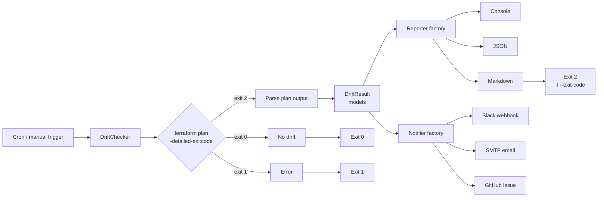

# Terraform Drift Detector

> Automated Terraform state drift detection with scheduled checks, alerting, and actionable reports.

[](https://github.com/shivajichaprana/terraform-drift-detector/actions/workflows/ci.yml)
[](https://github.com/shivajichaprana/terraform-drift-detector/actions/workflows/drift-detection.yml)
[](./LICENSE)
[](https://www.python.org/downloads/)

## Why this exists

Infrastructure drift happens in real life: someone clicks around in the AWS console, a deploy fails halfway and leaves partial state, an auto-recovery process bumps a setting, or a teammate applies a hotfix without a PR. `terraform plan` detects drift, but nobody runs it on a schedule and nobody alerts on the output. By the time an incident surfaces the drift, you've already lost hours to archaeology.

**terraform-drift-detector** closes that gap. It runs `terraform plan` against every workspace you care about on a cron schedule, parses the plan output for real drift, classifies it by severity, and pushes the results into Slack, email, or GitHub Issues — with enough context for someone to act on it.

## Workflow



The pipeline is intentionally boring: everything is a small component with a single job. The `DriftChecker` runs plans and builds `DetectionRun` objects. The reporter factory turns those into text. The notifier factory ships that text somewhere a human will see it. Each stage is independent, so adding a new output format or alerting channel is a single new file — see [docs/extending.md](./docs/extending.md).

## Features

- **Multi-target scanning** — monitor many Terraform root modules and workspaces in one run, parallelized with a configurable worker pool
- **Resource-level drift parsing** — identifies exactly which resources drifted, the drift type (add / change / destroy / replace), and the changed attributes
- **Severity classification** — `DESTROY` → critical, `REPLACE` → high, `CHANGE` → medium, `ADD` → low, with overrides via config
- **Three report formats** — rich console output with color and summary tables, structured JSON for downstream tooling, and Markdown suitable for Slack or GitHub Issues
- **Three notification channels** — Slack webhooks, SMTP email, and GitHub Issue creation (with deduplication by title)
- **CI-friendly** — `--exit-code` returns 2 when drift is detected so pipelines can gate on it; containerized via the included Dockerfile
- **Result persistence** — every run is saved as JSON to the configured results directory, so you can `drift-detector report --input <file>` later or diff runs over time
- **Scheduled workflow included** — drop-in GitHub Actions workflow that runs daily at 06:00 UTC and opens an Issue on drift

## Quick start

### 1. Install

```bash
git clone https://github.com/shivajichaprana/terraform-drift-detector.git
cd terraform-drift-detector
pip install -e .
```

This installs the `drift-detector` CLI on your PATH.

### 2. Configure

```bash
cp config.example.yaml config.yaml
$EDITOR config.yaml
```

At minimum, set the `targets` list to point at your Terraform root modules. See [docs/configuration.md](./docs/configuration.md) for the full reference.

### 3. Run detection

```bash
# Human-readable console report
drift-detector detect --config config.yaml

# Structured JSON (for downstream tooling)
drift-detector detect --config config.yaml --output-format json --output-file drift.json

# Send a Slack alert when drift is found
drift-detector detect --config config.yaml --notify slack

# CI mode: exit 2 on drift so the pipeline fails loudly
drift-detector detect --config config.yaml --exit-code
```

### 4. Re-render a past run

Every run is saved under `drift-results/` by default. You can replay a saved run in any format without re-running Terraform:

```bash
drift-detector report \
  --input drift-results/drift-2026-04-23T06-00-00.json \
  --format markdown \
  --output-file drift-report.md
```

## Example output

### Console

```
┌─ Drift Detection Run ────────────────────────────────────────────
│ Started:   2026-04-23 06:00:03 UTC
│ Duration:  47s
│ Targets:   3 scanned, 2 drifted, 0 errored
└──────────────────────────────────────────────────────────────────

  infrastructure/production (default)
  ────────────────────────────────────
  * aws_s3_bucket.logs                 CHANGE   medium
      + versioning.enabled: false -> true
  * aws_iam_role.deploy                REPLACE  high
      ~ assume_role_policy (drift in principals)
  * aws_security_group.bastion         DESTROY  critical
      - resource missing from state

  Summary: 3 drifted resources (1 critical, 1 high, 1 medium)
```

### Markdown (shipped to Slack / Issues)

```markdown
## Terraform Drift Detected — 2026-04-23 06:00 UTC

**3 drifted resources across 2 targets**

### infrastructure/production (default)

| Resource | Type | Drift | Severity |
|---|---|---|---|
| `aws_s3_bucket.logs` | change | versioning.enabled | medium |
| `aws_iam_role.deploy` | replace | assume_role_policy | high |
| `aws_security_group.bastion` | destroy | resource missing | critical |
```

## Supported notification channels

| Channel | Config section | Auth | Use case |
|---------|---------------|------|----------|
| **Slack** | `notifications.slack` | Incoming webhook URL | Real-time team alerts in ops channel |
| **Email** | `notifications.email` | SMTP host + credentials | Audit trail / on-call escalation |
| **GitHub Issues** | `GH_TOKEN` + `GITHUB_REPOSITORY` env vars | Personal or bot token with `issues: write` | Drift tracking that lives next to the code |

All channels share a common interface (`notifier.send(run, report_body)`) — adding a new channel is a single file. See [docs/extending.md](./docs/extending.md#adding-a-notifier).

## Running on a schedule

The repo ships with `.github/workflows/drift-detection.yml`, a GitHub Actions workflow that:

1. Runs daily at `06:00 UTC` (configurable via `schedule.cron`).
2. Installs Terraform + this tool.
3. Runs drift detection against the configured targets.
4. Creates a GitHub Issue titled `Drift Detected — <target> (<workspace>)` if drift is found, deduping by title so repeated drift updates the same Issue instead of spamming.
5. Optionally posts to Slack in parallel.

To run the detector elsewhere (Jenkins, GitLab CI, cron on a box, Kubernetes CronJob), use the included Dockerfile:

```bash
docker build -t drift-detector .
docker run --rm \
  -v $PWD/config.yaml:/app/config.yaml \
  -v $HOME/.aws:/root/.aws:ro \
  -e SLACK_WEBHOOK_URL \
  drift-detector detect --config /app/config.yaml --notify slack
```

## Configuration

All behaviour is driven by a single YAML file. A minimal config:

```yaml
targets:
  - path: ./infrastructure/production
    workspaces: [default]
  - path: ./infrastructure/staging
    workspaces: [default]

detection:
  parallelism: 2
  refresh_only: true
  output_format: console

notifications:
  slack:
    webhook_url: ${SLACK_WEBHOOK_URL}
    channel: "#infrastructure-alerts"
    notify_on: drift
```

Full reference: [docs/configuration.md](./docs/configuration.md).

## Project layout

```
terraform-drift-detector/
├── detector/
│   ├── __init__.py          # Package metadata & version
│   ├── __main__.py          # python -m detector entry point
│   ├── cli.py               # argparse CLI (detect / report subcommands)
│   ├── config.py            # YAML config loader with env-var expansion
│   ├── drift_checker.py     # Core: terraform plan runner + parser
│   ├── models.py            # DetectionRun, DriftResult, DriftedResource
│   ├── reporters/           # Output formatters
│   │   ├── console_reporter.py
│   │   ├── json_reporter.py
│   │   └── markdown_reporter.py
│   └── notifiers/           # Alert senders
│       ├── slack_notifier.py
│       ├── email_notifier.py
│       └── github_notifier.py
├── tests/                   # pytest unit tests with mocked terraform output
├── scripts/
│   └── run-drift-check.sh   # CI wrapper (init + workspace select + detect)
├── examples/
│   └── multi-repo-config.yaml
├── .github/workflows/
│   ├── ci.yml               # pytest + flake8 + mypy on every push
│   └── drift-detection.yml  # daily cron -> detect -> open Issue
├── Dockerfile               # Containerized detector
├── config.example.yaml
├── setup.py
└── requirements.txt
```

## Requirements

- Python >= 3.9
- Terraform CLI (tested with 1.5+)
- Valid backend credentials for each target (AWS / GCP / Azure / etc.)
- For the GitHub Actions workflow: a repository with `issues: write` permission

## Documentation

- [docs/configuration.md](./docs/configuration.md) — every config option, with examples
- [docs/extending.md](./docs/extending.md) — add custom reporters and notifiers
- [CONTRIBUTING.md](./CONTRIBUTING.md) — dev setup, style, PR process

## License

MIT — see [LICENSE](./LICENSE).
